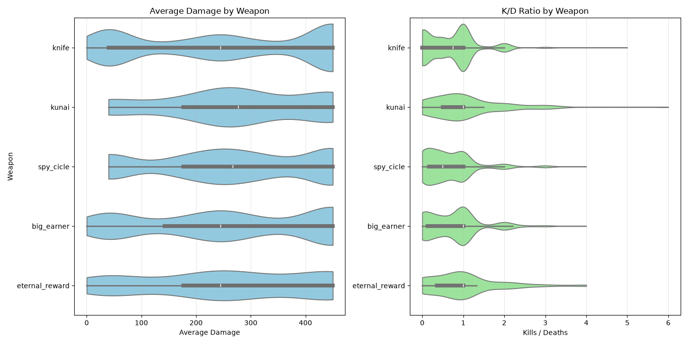
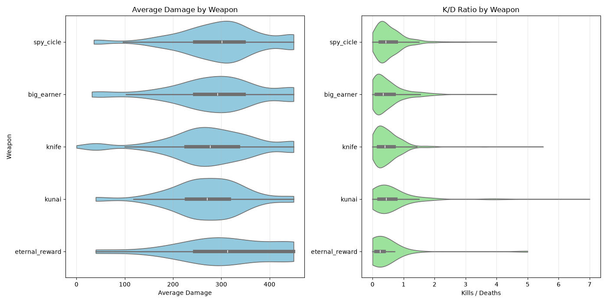

# Research Question

> Generally, what knife is the most effective weapon in experienced Team Fortress 2 lobbies?

Team Fortress 2 (abbreviated to tf2) is a first person shooter game. Each class has various unlockable weapons that can be substituted for their base forms.

In this project, we will explore the weapons of one class: the Spy. The class has a total of five options for knives (excluding cosmetics, which do not affect gameplay) and each have their own strengths and weaknesses. For example, the "Big Earner" lowers the Spy's health, but grants a speed boost after a backstab.

Each knife functions differently. The stock knife, known as "Knife", is the simplest. If you hit a player's back, you are rewarded with an instant kill. All other knives use this as the template. The Your Eternal Reward (YER) has drawbacks relating to Spy's stealth mechanics, but the ability to kill players silently to avoid detection. The Spycicle can protect a spy temporarily from the Pyro class, at the cost of backstab ability when melted by said Pyro. The Big Earner grants a speed boost on kill, but lowers the Spy's health by 20%. Similarly, the Kunai grants bonus health upon backstabs, at the cost of lowering the Spy's base health by 44%.

Although this question serves no broad societal purpose or commentary, and does not matter to the majority of the population, tf2 has a small and dedicated playerbase who want to perform to the best of their abilities.  Identifying the option that gives players the biggest advantage would be extremely useful to any who seek to improve their tf2 results. The target audience for tf2 players looking to learn more about the game. Not only does this apply to Spy players, who will be searching for the best knife they can use, but this applies to any player looking to counter Spy, as they should practice most against his strongest option.

# Data Description / Key Variables

To determine the most effective knife, we will be looking at a few variables. The first is the kills-to-deaths ratio. Across the match, how many players did the knife kill? How many times did the Spy die? This will provide a fair assessment of how the Spy performed in their match. This will be our main benchmark for success, as the stronger a weapon is, the higher this ratio should be. You should be getting more kills between your inevitable deaths.

We will also be investigating how much damage the knife dealt across the match duration. The benefit of this metric is to determine if the Spy was killing players who were a key threat, or if the Spy was picking off already weak players. This is the less important metric, due to the way the Spy's knife works. A backstab (hit from a players back 180 degrees) will always instantly kill the target, regardless of how much health they had remaining. So, a Spy may get 20 kills, but if each kill was already low health, the damage will reflect poorly. However, on the other extreme, if the Spy exclusively kills high-health Heavys (a class with the largest health pool), then this metric will be inflated.

Importantly, since all knives share the same backstab mechanic, and the predominate usage of knives *is* to backstab, damage between knives should be comparable. The two differences being the amount of kills and the "quality" of the kills, so to speak. Since kills-to-death ratio (henceforth abbreviated as KDR) already accounts for kills, the damage metric will be somewhat redundant.

# Dataset

The dataset was gathered through the api [logs.tf](https://logs.tf/). The website is a place for players to submit log files to add to the database. Our dataset was acquired by polling the api and scanning the resulting game data. One assumption we must make is that the knives are being used by players of very similar experience. Though this may not be true, and likely isn't, it is impossible to quantify the experience of a player through this API, and thus this assumption must be made for the sake of data comparison.

The api provides two main endpoints. Firstly, the api provides a way of retrieving a list of games played. This includes (exhaustively):

1. The match identifier.
2. The name of the map the match was played on (this includes the mode).
3. The title of the match (not useful to us).
4. The timestamp of the match (not useful to us).
5. The number of times the match was queried (not useful to us).
6. The number of players in the match (redundant).

The other endpoint the api provides is to retrieve match-specific data. We are not concerned with the overall match data. Instead, we focus on the player performance metrics. For every player, the api has a per-class breakdown of how the player did. This includes, but is not limited to:

1. The class the player played.
2. The number of kills they got.
3. The number of deaths they had.
4. Their total damage output.
5. The total time they played the class.

Additionally, the class breakdown also includes a per-weapon breakdown, listing:

1. Name of the weapon.
2. Damage of the weapon.
3. Average damage of the weapon over the match.

We analyze all of this data and collect it all into a table.
| game_id | map | game_type | player_id | weapon | kills | dmg | avg_dmg | deaths | total_time |
| --- | --- | --- | --- | --- | --- | --- | --- | --- | --- |
| 4120525 | cp_process_f12 | capture_point | [U:1:1145622737] | letranger | 0 | 0 | 0.0 | 1 | 46 |
| 4120520 | cp_snakewater_final1 | capture_point | [U:1:420680524] | letranger | 1 | 42 | 42.0 | 0 | 32 |

The size of the dataset was limited to the runtime of the api polling script.

# Data Cleaning

First, we remove all entries for weapons we do not care about.

```python
# Only keep weapons we care about
WEAPON_WHITELIST = {"knife", "kunai", "spy_cicle", "eternal_reward", "big_earner"}
df = df[df["weapon"].isin(WEAPON_WHITELIST)]
```

Before this step, the data included weapons such as the "Crusader's Crossbow." Notably, the Crusader's Crossbow is not a Spy weapon.
> The Crusader's Crossbow is a community-created primary weapon for the Medic. [^1]

[^1]: https://wiki.teamfortress.com/wiki/Crusader%27s_Crossbow

Additionally, the data also included the Spy's other weapons, such as various pistols. The simplest solution was to only analyze weapons from a predetermined list of Spy knives.

Next, we precalculate the kdr from the `kills` and `deaths` fields.

```python
# Calculate KDR
df["kdr"] = df["kills"] / df["deaths"].replace(0, 1)
```

# The Data

### Capture Point matches



### Payload matches



> Explain the patterns, trends, or anomalies each graphic reveals

Using these violin graphs, we can observe the boxplot in addition to the distribution of data (Hintze, Nelson). Initially, I planned to use a simple boxplot, but with the sheer sample size, I wanted to make clear just how uncommon the outliers were (there were many outliers). As seen by the medians within each graph, few knives achieved a median of at least one. As it turns out, Spy is a weak class.

Regardless, a classes lack of strength does not take away that one of their weapons ought to be generally stronger than another. For understanding the best knife, we will use K/D as the primary indactor, and damage as a tiebreaker.

In capture points, the knives with the highest medians are the Kunai, the Big Earner, and the Your Eternal Reward (YER). Looking at the damage, the Kunai has a stronger median than the YER and Big Earner by about twenty points.

In payload, the medians are much closer. Importantly as well, the KDRs are all far worse. It can be argued that since you will be dying plenty no matter which knife you use, it will be more beneficial to your team to use the YER, the knife with the highest damage median. However, by pure metric of KDR, the Spycicle barely has the highest median. 

Interestingly, the YER has the smallest median for KDR, yet the highest for damage. The best explanation for this anomaly I can think of is that the YER spy is much more likely to target Heavys (the class with the highest health pool) than the other knives. Whereas the other knives encourage targetting individual, low-health targets, like Snipers and Engineers, the YER incentives approaching the frontline with high-health targets, like Heavys and Soldiers.

Generally, it seems that the Kunai is your strongest option across the two gamemodes. It is seemingly the strongest in capture points, and all knives yield similar results in payload. Also, when tracking the KDR, the Kunai is the most consistent knife to its median. This means that, on average, there will be less games of underperformance.

It would be incorrect to definitively call the Kunai the strongest knife. There are many variables that could be throwing this factor off. For example, the Kunai is a knife that demands an incredibly technically demanding playstyle, whereas the Knife and the YER promote more passive gameplans. The technical demand of the Kunai (and thus its barrier to entry) may result in skewed data on the average skill of the player wielding it. It is very possible that without much Spy experience, a Spy would be better off with a simpler knife, like the Knife or the Spycicle.

# Ethics, Limitations, and Reflection

This dataset cannot perfectly represent the research question. “Experienced tf2 lobbies” are completely subjective and cannot be quantified. Does every player having 20 hours make them experienced? 50? 100? There is no way to be sure. However, a fair amount of work must be put in to reach a tf2 private server, so it is a decent benchmark of experience.

Furthermore, this private server does not represent all experienced tf2 players. Many tf2 players exclusively play in a tournament setting, which this server does not capture. There are also certain modes of play not covered, like a deathmatch (without respawns) and highlander (limit to one of each class). It is known statistical knowledge is wrong to generalize a specific population to a much broader population (Chen). Thus, it would be wrong to generalize this specific private server to all experienced tf2 lobbies.

The greatest limitation of this dataset is that there is no way to account for individual player skill. While one knife may be weaker than another, if there is an incredibly skillful player who uses what might be a weaker knife, the actual potential of the weapon will not be reflected in the dataset (Fox). I can only hope that the sheer sample size is enough to minimize the effect of outlier players in the dataset.

If I were to investigate tf2 statistics again, I would choose a more straightforward weapon to analyze. The Spy's knife is one of the most complex weapons in the game, with the backstab mechanic and the entire playstyle revolving around this weapon. Simpler weapons like the rocket launcher or the flamethrower would have made for interesting analysis as well.

The reason I chose to analyze the knife is that the Spy mainly relies on it. Spies also have access to a revolver, but tend not to use it terribly much since the knife is by far their strongest option. They also have access to an invisibility watch, but this is not tied to damage or kills. Thus, I figured that the knives would be the most straightforward to analyze, but I believe this is a mistake. Damage is almost irrelevant with these knives and makes for a poor metric, and the KDR of the weapons ended up very similar.

# Code and Transparency

[My GitHub Repository](https://github.com/StephenHeagarty/Project1)

I used AI to assist me in creating the graphs to represent my data. I used the default ChatGPT version with the prompt:
> given the following csv header game_id,map,game_type,player_id,weapon,kills,dmg,avg_dmg,deaths,total_time, using python pd and mpl create a boxplot graph of weapon name vs. kills/deaths and weapon name vs avg_dmg

I am not very experienced with the libraries Seaborn and Matplotlib. It was faster to generate the code and review it for understanding.

This was the only instance of AI usage in the project.

# Sources

Chen, S. W., Keglovits, M., Devine, M., & Stark, S. (2021). Sociodemographic Differences in Respondent Preferences for Survey Formats: Sampling Bias and Potential Threats to External Validity. Archives of rehabilitation research and clinical translation, 4(1), 100175. https://doi.org/10.1016/j.arrct.2021.100175

Fox, C. D. (2020). The Development of a Framework for Weapon Balancing in Multiplayer First-Person Shooter Games (Version 1). Purdue University Graduate School. https://doi.org/10.25394/PGS.12107280.v1

Hintze, J. L.; Nelson, R. D., 1998, *Violin Plots: A Box Plot-Density Trace Synergysim*, the American Statistical Association, https://www.stat.cmu.edu/~rnugent/PCMI2016/papers/ViolinPlots.pdf